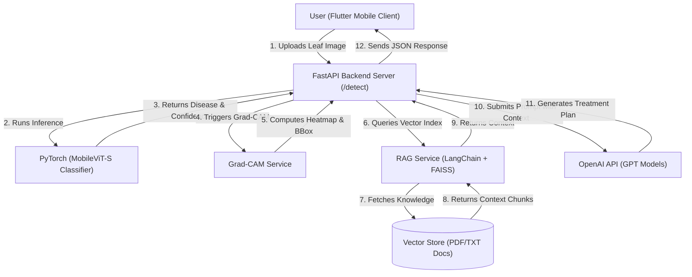
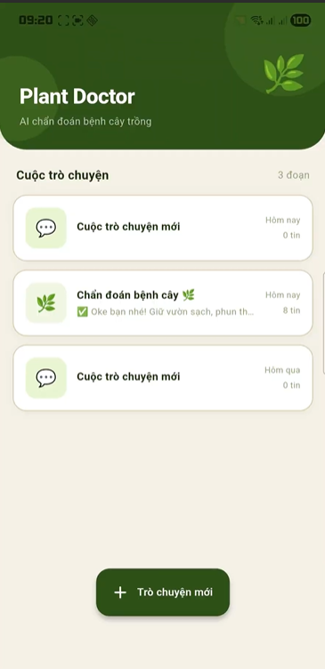

# 🍃 AI-Driven Plant Disease Diagnosis: EfficientNetV2 vs. MobileViT

[](https://www.python.org/)
[](https://pytorch.org/)
[](https://fastapi.tiangolo.com/)
[](https://www.langchain.com/)
[](https://openai.com/)
[](https://flutter.dev/)

> **Deep Learning Course Project:** A comparative study evaluating a pure Convolutional Neural Network (**EfficientNetV2**) against a hybrid Transformer-CNN architecture (**MobileViT**) for diagnosing diseases in tropical cash crops (**Coffee, Rice, and Black Pepper**), integrated with an OpenAI LLM-powered **RAG (Retrieval-Augmented Generation)** conversational advisory system.

---

## 📋 Table of Contents
- [Overview](#-overview)
- [Key Features](#-key-features)
- [System Architecture](#-system-architecture)
- [Tech Stack](#-tech-stack)
- [Project Directory Structure](#-project-directory-structure)
- [Getting Started](#-getting-started)
  - [Prerequisites](#prerequisites)
  - [Installation](#installation)
  - [Configuration](#configuration)
  - [Running the Server](#running-the-server)
- [API Endpoints](#-api-endpoints)
- [Demo Video](#-demo-video)
- [Contributors](#-contributors)

---

## 📋 Overview
This project provides a comprehensive end-to-end framework for agricultural plant disease diagnosis. It spans from model training and evaluation to server-side deployment and mobile integration.

* **Core Deep Learning Models:** Through empirical evaluation, **MobileViT-S** was selected for deployment due to its lightweight profile (only **4.95M parameters**, ~20MB weight size) and stable convergence, making it ideal for Edge AI and resource-constrained environments.
* **Intelligent API Server:** Built on **FastAPI**, the backend handles image uploads, runs model inference, generates explainability maps (Grad-CAM), and queries a localized agricultural vector database (RAG) to generate tailored treatment prescriptions via OpenAI's GPT models.

---

## ✨ Key Features
* 📷 **Accurate Image Classification:** Detects and classifies common diseases affecting **Coffee, Rice, and Black Pepper**.
* ⚡ **Edge-Optimized Inference:** High-speed inference utilizing lightweight models without straining server memory.
* 🔍 **Explainable AI (XAI):** Built-in **Grad-CAM** generates visual heatmaps highlighting the exact regions on the leaf that influenced the model's decision.
* 📚 **Context-Aware RAG Advisory:** Utilizes LangChain and FAISS to search Vietnamese agricultural reference textbooks for verified treatments based on the detected disease.
* 🤖 **Agricultural Virtual Assistant:** Provides a chat-based LLM interface allowing farmers to ask follow-up questions about medication, dosages, and preventative measures.

---

## 🏗️ System Architecture



---

## 🛠️ Tech Stack
* **Deep Learning:** PyTorch, `timm` (Torch Image Models), torchvision, Grad-CAM (Explainable AI)
* **Backend API:** FastAPI, Uvicorn, Pydantic
* **RAG & Vector Search:** LangChain, FAISS (Vector database), OpenAI Embeddings (`text-embedding-3-small`)
* **LLM Integration:** OpenAI GPT API (`gpt-3.5-turbo` / `gpt-4`)
* **Frontend:** Flutter (Dart) for mobile application delivery

---

## 📂 Project Directory Structure

```text
├── models/                  # Trained PyTorch model weights (.pth)
│   ├── best_mobilevit.pth   # Selected MobileViT-S model (deployed)
│   └── best_model.pth       # Alternative EfficientNetV2 model
├── notebooks/               # Jupyter notebooks for training & experimentation
│   ├── EfficientNetv2/      # EfficientNetV2 training scripts
│   └── MobileVit/           # MobileViT training scripts
├── server/                  # API server & services implementation
│   ├── app.py               # Main FastAPI server entry point
│   ├── predict.py           # Image pre-processing & model inference
│   ├── chatgpt_service.py   # OpenAI API interaction & validation
│   ├── gradcam_service.py   # Grad-CAM heatmap visualization service
│   ├── rag_service.py       # LangChain + FAISS retrieval service
│   └── main.dart            # Flutter application frontend codebase
├── docs/                    # Source reference PDF/TXT documents for RAG (by crop)
│   ├── lua/                 # Documents regarding Rice diseases
│   ├── ca_phe/              # Documents regarding Coffee diseases
│   └── tieu/                # Documents regarding Black Pepper diseases
├── faiss_indexes/           # Local FAISS vector databases (auto-generated on startup)
└── README.md
```

---

## 🚀 Getting Started

### Prerequisites
- Python 3.9 or higher
- An OpenAI API Key

### Installation

1. Clone the repository and navigate to the project directory:
   ```bash
   git clone https://github.com/namnguyenviettt/Plant-Disease-Diagnosis-EfficientNetV2-vs-MobileViT-2026.git
   cd Plant-Disease-Diagnosis-EfficientNetV2-vs-MobileViT-2026
   ```

2. Install the required packages:
   ```bash
   pip install torch torchvision timm pillow fastapi uvicorn pydantic python-dotenv langchain langchain-community langchain-openai faiss-cpu pypdf sentence-transformers
   ```

### Configuration

1. Create a `.env` file in the root or the `server/` directory:
   ```env
   OPENAI_API_KEY=your_openai_api_key_here
   ADMIN_SECRET=plant123
   ```
2. Place your crop-related reference textbooks (PDF or TXT formats) into their respective subfolders under `docs/` (`docs/lua/`, `docs/ca_phe/`, `docs/tieu/`) to build the RAG knowledge base.

### Running the Server

Start the FastAPI application with Uvicorn:
```bash
cd server
uvicorn app:app --host 0.0.0.0 --port 8000 --reload
```
On startup, the application will automatically build the FAISS indexes from files in the `docs/` folder. Once loaded, the API will be available at `http://localhost:8000`.

---

## 📡 API Endpoints

| Endpoint | Method | Description |
| :--- | :--- | :--- |
| `/conversation/new` | `POST` | Generates a new unique `conversation_id` session. |
| `/detect` | `POST` | Upload leaf photo. Returns top-3 predictions, confidence, Grad-CAM heatmap (Base64), and RAG-augmented treatment. |
| `/chat` | `POST` | Ask standard follow-up questions within an existing session. |
| `/chat/stream` | `POST` | Stream answers from the LLM assistant using Server-Sent Events (SSE). |
| `/admin/rebuild-indexes`| `POST` | Rebuilds the FAISS vector databases from local files. |
| `/health` | `GET` | Returns service status and active vector stores. |

---

## 📺 Demo Video

[](https://drive.google.com/file/d/1y4H0hEzIDwFltWM-gjwxVuZxN2XiRi-Y/view?usp=sharing)

---

## 👥 Contributors

* **Nguyễn Việt Nam** - [@namnguyenviettt](https://github.com/namnguyenviettt)
* **Hồ Minh Hiếu** - [@iamminhhieuz206-sys](https://github.com/iamminhhieuz206-sys)
* **Đỗ Nguyên Khoa** - [@khoadepzaivl](https://github.com/khoadepzaivl)
